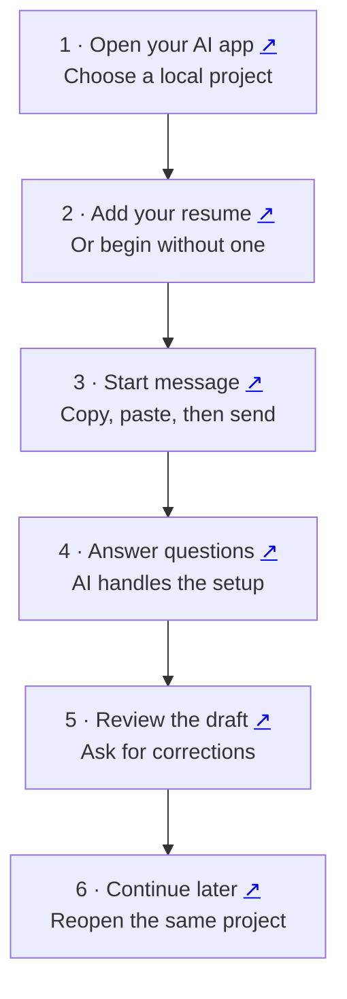

# Job Search

A guided job search in **Codex, Claude Code, OpenCode or T3 Code**. You answer questions and review applications; the AI organizes your records and prepares the documents.

[Start here](#first-time-step-by-step) · [Use it again](#coming-back-later) · [Daily search](#your-weekday-morning-search) · [Help](#if-something-stops-you)

**Share:** [PDF guide](docs/job-search-guide.pdf) · [Slides](docs/job-search-guide.pptx) · [Full walkthrough](docs/setup.md)

## The flow at a glance

Click the small ↗ beside a step to open its instructions.



## First time: step by step

### What you need before starting

- **An AI app and account:** Codex, Claude Code, OpenCode or T3 Code with access to local projects and files. Download links are in step 1 below.
- **A dedicated project folder:** the AI needs permission to read your inputs and save your records there.
- **Internet access:** needed to download the skill, set up missing software and search for current jobs.
- **Your resume, if you have one:** PDF or Word is useful; you can also start without one.

**The AI handles dependencies.** It checks for Python 3.9+ (preferring a maintained 3.12+ runtime), arranges a private Python if needed, and installs the document and timezone packages in a separate local cache. You do not need to install Node or Git for the download-and-copy route. The optional `npx` terminal installer needs Node.js 22.20+.

PDF viewing is required to inspect generated pages. If a Word document will be uploaded, the AI also needs Word, LibreOffice or another available DOCX renderer to inspect that actual document. It checks PATH and standard LibreOffice locations; if a needed tool is unavailable, it explains the next action and keeps the file as a draft.

[Dependency details and setup checks](docs/setup.md#prerequisites-and-dependencies).

**Allow for usage.** Tailoring documents, visually checking each page and preparing upload copies can use a substantial part of your AI plan's allowance. Limits and any API charges depend on your app, model and plan. Ask for **PDF only** when a Word file is not required to reduce the work. If you hit a limit, return to the same project after it resets.

<a name="1-open-codex-or-claude-code"></a>

### 1. Open your AI app

#### a. Install and sign in

Choose your computer, download the app and sign in:

| App | Mac | Windows |
| --- | --- | --- |
| Codex | [Download page](https://learn.chatgpt.com/docs/app) | [Download page](https://learn.chatgpt.com/docs/windows/windows-app#download-the-chatgpt-desktop-app) |
| Claude Code | [Claude downloads](https://claude.com/download) | [Claude downloads](https://claude.com/download) |

**Already using OpenCode or T3 Code?** Use your existing app. Select the job-search folder and an agent that can edit files and run local commands. In T3, also select and authenticate its underlying provider; T3 uses that provider's installed skill. Downloads: [OpenCode](https://opencode.ai/download), [T3 Code](https://github.com/pingdotgg/t3code/releases). You can use the same start message below.

For Codex, install the ChatGPT desktop app and select **Codex**. For Claude, open its **Code** tab and choose **Local**.

Ctrl+click on Windows or Command+click on Mac opens a download link in a new tab.

#### b. Choose your project

A project is the folder the AI works in. Use a dedicated folder such as **My Job Search** so your search records have a clear home.

**Codex:** click **Choose project** above the message box. Select an existing job-search project, or open **Create project**.


**Claude Code:** open **Code → Local**, then click **Select folder**. Choose your existing job-search folder, or create one as described next.

#### c. Select or create the folder

If you need a new folder, create **My Job Search** in Documents using File Explorer on Windows or Finder on Mac. You can also use **New folder** in the folder picker if available.

In Codex's **Create project** window:

- Enter **My Job Search** as the project name.
- Under **Source folders**, choose **Add a folder on this computer**, then click **Add**.
- Select your folder and confirm, then click **Create project**.


In Claude Code, select the folder through **Select folder** and confirm. The picture above shows Codex; Claude's folder picker looks different.

Check that your chosen project is selected before sending the first message. The AI creates the remaining folders and records for you.

<a name="allow-the-ai-to-read-and-save-files"></a>

#### d. Codex: choose Full access

Click the permission label below the message box and select **Full access**.


Full access allows internet access and file changes, including files outside the selected project. This is the Codex setting used in this walkthrough.

The skill can also work with narrower permissions and your approvals. It normally keeps its private `records` folder inside your chosen project, so access to the whole computer is not a technical requirement.

#### e. Claude Code: choose Auto

Click the mode label below the message box and select **Auto**.


Claude handles permission decisions with automatic safety checks. Some actions can still require your approval.

These screenshots show the author's desktop apps; labels can vary by version. If the AI requests access to a particular records folder or approval to install the skill, review that specific request. [More about permissions](docs/setup.md#allow-the-ai-to-read-and-save-files).

#### f. Optional: connect Gmail before the first message

Connect Gmail now if you want the AI to help track job-related replies. Doing this **before the installation message** avoids a sign-in interruption during the interview.

| Your app | Where to connect Gmail |
| --- | --- |
| Codex desktop | Open **Plugins**, find **Gmail**, install/enable it if needed, then complete its connection flow. |
| Claude Code desktop | Open **+ → Connectors** or **Settings → Connectors**, choose **Gmail / Google Workspace**, and connect it. |

Sign in to the Google account you plan to use for applications. If that account is already connected, leave it in place. Complete any sign-in or app-requested session restart before continuing.

**You can skip this.** Gmail is optional for installing the skill, preparing resumes and finding jobs. If the connector is unavailable or you do not want inbox access, continue to step 2.

During setup, the skill confirms your application email and whether it may read job-related replies, then checks the existing connection. It asks you to connect or switch accounts only if needed. App sign-in alone does not authorize the skill to send email or change your calendar.

**Also optional: Google Calendar.** If you want help adding interview events, connect **Google Calendar** through the same app menus now. The skill will verify your calendar choice and obtain permission before creating or changing events. This is separate from Gmail access.

**OpenCode / T3:** use only connections available to the selected agent or provider. A Gmail connection in another desktop app does not automatically carry over. Skip this step if no supported connection is available; the AI can work from replies you paste.

Sources: [Codex plugins](https://learn.chatgpt.com/docs/plugins), [Claude Code connectors](https://code.claude.com/docs/en/desktop#extend-claude-code). More detail: [Inbox workflow](skills/job-search/references/mail.md).

### 2. Add your resume before sending

Choose **one** way to begin:

- **Attach a resume:** add your PDF or Word file to the message box before sending.
- **Use its file location:** paste the full location beneath the start message, after `My resume is at:`.
- **Start without one:** add `I do not have a resume yet. Help me build one.`

The AI checks that it can read your resume. If it cannot, it asks for the missing file or readable text.

You can also paste your **LinkedIn profile link** now. If you want it on your resume, the AI saves the correct link before formatting. A resume and a LinkedIn profile are both optional.

<a name="3-paste-this-message-then-press-send"></a>

### 3. Copy the start message, then press Send

Paste both lines into the **same message box** as your resume or its location:

```text
Install https://github.com/toughdave/job-search for this project.
Then use job-search to start my search.
```

**Press Send once.** This message asks the AI to install the skill and begin your setup. Follow any specific installation approval or restart instruction.

If the newly installed skill does not appear, start a **new conversation in the same project**, then summon it using the instructions under [Use it again](#coming-back-later).

You do not need to add instructions about asking one question at a time or managing files. Those are built into the skill.

### 4. Let the AI set up, then answer its questions

**The AI handles the software setup too.** It checks Python, installs missing document and timezone packages in a private environment, and verifies that documents can be created and PDFs rendered. If Python is missing, it arranges a private runtime. You may see a download or approval request. Node is only needed for the optional terminal installer; the AI can install the skill without it.

Your answers and documents usually go in a private **records** folder inside your project. The AI tells you the location. Large software packages stay in a separate local cache on your computer.

The terminal command below copies the skill. Summoning it afterward starts these setup checks. If a required tool cannot be installed, the AI explains the specific next action and keeps unfinished setup visible.

The AI saves your records in a private location and tells you where. It asks **one question at a time**, reusing information you have already supplied.

The conversation covers the details needed for your search:

- Your target work, location and working preferences.
- Each employer, role and period, with real examples of what you did.
- Education, certifications, skills, contact details and relocation preferences.
- Common application answers, either during setup or when a form needs them.

For example, it might ask:

> At Cedar Clinic, tell me about one scheduling problem you handled as an office assistant.

Your answer stays linked to that employer and work period. If the session ends, the AI reads the saved progress before continuing.

**LinkedIn:** with your permission, it compares your profile with your records, brings in additional useful details and asks about conflicts. It offers a fuller profile review after enough career information is gathered. Public edits require your approval.

**Resume length and local format:** after reviewing your work history and where you are applying, it recommends one page, two pages or a longer CV where appropriate. It asks you to approve that standard, saves your choice and uses it for matching applications. It also reviews page spacing and the destination's conventions.

**Daily search:** it also offers a weekday morning routine. You can accept it, change the time or keep searches manual.

**Optional inbox access:** if you connected Gmail in step 1, the AI verifies that existing connection after confirming your application email and read permission. If you skipped it, you can connect later or continue without inbox access. [Connection steps](skills/job-search/references/mail.md).

The interview stays brief: one useful question at a time, with a short explanation only when needed. When you stop, ask how to return, or reach the first setup handoff, the AI saves a short return note and gives you the exact way to return in **your app**, your project/records location and the next action. You can stop before the interview is complete. It does not make you read instructions for every app.

### 5. Review the first useful result

The AI can prepare useful drafts while the interview continues. Open the documents and check your experience, dates, qualifications and contact details.

**Before uploading a resume or CV to an application form, the AI must visually inspect every page of the actual file.** It checks clipping, alignment, spacing, page breaks and readability, fixes problems, and reviews the corrected version again. A PDF generated separately from a Word file does not verify the Word file's layout. If visual review cannot be completed, the upload waits.

Give corrections directly in the conversation, for example:

> That role was volunteering. Please correct it.

Review the employer, role and final documents before authorizing submission. If information or access is missing, the AI should explain the next action.

You can supply several resume versions; the AI reconciles their evidence before using old claims. It prepares tailored letters where accepted and uses clean upload filenames after visual review.

When an employer replies, return to this project and say **“Help me prepare for this next step.”** The AI can build a recruiter-screen or interview pack, prepare for an assessment, review an offer, and record an interview debrief. Sending messages, sharing sensitive documents and creating calendar events still require your authorization.

<a name="coming-back-later"></a>

## 6. Coming back later

**a. Reopen** the same project you used before.

**b. Summon** the skill using your app's shortcut below, then send:

```text
Continue my job search.
```

**c. Continue** from your saved progress. Supply a new resume if it has changed; otherwise you do not normally need to reinstall or attach it again.

<a name="already-installed"></a>

## Summon the skill

Use your AI's message box after installation:

| App | Shortcut |
| --- | --- |
| Codex / ChatGPT desktop | Type `@` and choose **job-search**; use `$` if your composer has that skill picker. |
| Codex CLI / IDE | `$job-search` |
| Claude Code | `/job-search` |
| OpenCode | Send `Use job-search to continue my job search.` Use `/job-search` only if your version lists it. |
| T3 Code | Type `$`, select **job-search** for the selected provider, then add your request. The `/` menu may list it too. |

Add **Start my search** or **Continue my job search**, then send.

**New chat or restart?** Keep going here if the AI has loaded the installed skill. A new chat is a fallback when the picker has not refreshed; a full app/provider restart is needed only if discovery still fails or your app requires it. Your saved interview stays in the same project. [App-specific details](docs/setup.md#new-chat-or-restart).

If the skill is missing, say: **“Check whether job-search is installed in this project and help me load it.”**

If a short follow-up seems to ignore your saved progress, summon the skill again and say **“Reopen my project records before continuing.”** Automatic skill selection can vary between sessions.

## Your weekday morning search

During setup, the AI proposes job titles and search sites, then offers **weekdays at 9 a.m.** It confirms your timezone and preferences; you can change the time or keep searches manual.

The AI saves the daily instructions and checks unfinished applications alongside new listings. Suitable matches become drafts for your review.

Keep your **computer awake and desktop app running** for local searches. Find the scheduled task here:

- **Codex:** Scheduled.
- **Claude Code:** Code → Routines.

To change it, say **“Pause my scheduled search”** or **“Move my daily search to 8 a.m.”**

**OpenCode / T3:** use the saved search prompt manually unless a supported scheduler is separately verified. Installing the skill does not create a timer or transfer another app's schedule.

[More about daily searches and CLI limits](docs/setup.md#your-weekday-morning-search).

## If something stops you

If the AI stops after a progress update without giving you a question or next action, send **`Continue`** in the same conversation. It should resume from your saved progress.

Tell the AI what happened. For missing records, provide the private location it gave you and say **“Resume my existing search here; do not start over.”** [More help](docs/setup.md#if-something-stops-you).

If you renamed or moved your project, say **“I moved this job-search project. Reconnect my existing records here.”** The AI confirms the new location, preserves your answers and checks any saved routine before resuming it.

To free the software cache for a finished search, say **“Show me this project's runtime cache and help me remove it.”** The AI previews the exact cache, asks before removal, and keeps your records and resumes. For a deleted project, it can list only job-search's owned caches so you can select the right one. A missing folder may mean a move, so cleanup is never automatic. Software can be installed again when needed.

<details>
<summary>Update or install from a terminal</summary>

To update, send:

```text
Update job-search from https://github.com/toughdave/job-search.
Preserve my private records and local customizations, then continue my search.
```

Or install from your project terminal with Node.js 22.20+:

```sh
npx skills@1.5.26 add toughdave/job-search --skill job-search --agent codex claude-code --copy -y
```

Use only the agent you need: `codex`, `claude-code` or `opencode`. For T3, choose the underlying provider, not `t3`. Then summon the skill above. Opening the GitHub link alone does not install it.

</details>

[Full walkthrough](docs/setup.md) · [Skill instructions](skills/job-search/SKILL.md)
