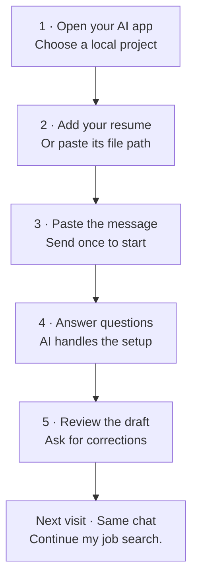

# Job Search

Your job search, guided through a conversation in **Codex or Claude Code**. You supply your experience and decisions. The AI organizes the files, asks questions, and prepares applications for your review.

**[First time: start here](#first-time-step-by-step)** · **[Already installed](#already-installed)** · **[Coming back later](#coming-back-later)** · **[Need help?](#if-something-stops-you)**

## The flow at a glance



## First time: step by step

### 1. Open Codex or Claude Code

Sign in to a version that can work with files on your computer. Start a conversation in a **dedicated local project/folder**, such as **My Job Search**. Here, “project” simply means the folder the AI is working in.

| Your app | Where to start |
| --- | --- |
| Codex app | Open or create a local project using a folder for this job search, then start a conversation there. |
| Claude desktop | Open **Code**, select **Local**, choose your job-search folder, then start a conversation. |
| Codex or Claude Code in a terminal/editor | Start it in the folder you want to use for this job search. |

Use a local session, rather than an ordinary browser chat. You do not need to download this repository or create the skill's internal folders yourself.

### 2. Add your resume before sending

Use **one** method:

- **Attach it:** if your app accepts the document, add your PDF or Word resume using its attachment control. Check that the attachment appears before sending.
- **Supply its location:** copy the full location of the resume on your computer. Paste it beneath the message in step 3, after `My resume is at:`. Use the actual location of your file.
- **No resume yet:** add `I do not have a resume yet. Help me build one.` The AI can start by asking about your work or study.

The AI must confirm it can read the file. An attachment icon alone does not prove that it received readable resume text.

### 3. Paste this message, then press Send

Copy the complete message below into the **same message box** where you added your resume or its location:

```text
Install https://github.com/toughdave/job-search for this project. Use job-search with my resume, handle the setup, and ask one question at a time. Set a goal to prepare my first suitable application for review.
```

**Send this once.** It asks the AI to install and begin; you do not also need a terminal command or “Continue my job search” now. Include your resume location or no-resume line before sending if you chose that option.

### 4. Let the AI set up, then answer its questions

The AI should check the installation, read your resume, create a separate private place for your records, and ask one useful question at a time. It should tell you where it saved your search. If it needs an installation approval, a writable location, or a restart, follow that specific instruction before continuing.

For example, after reading your resume it might ask:

> **AI:** What kind of work would you most like to do next?
>
> **You:** Office administration or customer support.

Give your own answer. The AI saves it and asks the next question when needed. You do not fill out a tracker or arrange application folders.

### 5. Review the first useful result

When enough is known and the tools are available, the AI works toward a suitable application draft. Open its documents, check the facts, and give corrections in the conversation. For example: `That role was volunteering. Please correct it.`

If it cannot search the web, it may ask for a job posting. If a required fact or tool is missing, it should explain the next action instead of claiming the application is ready. Review the employer, role and document versions before authorizing a final submission.

**That is the first-time process. The sections below are for later visits or optional help.**

## Already installed

Skip installation. Open the **same local project**, add your resume or its location if you have not already supplied it, and send:

```text
Use job-search with my resume. Ask one question at a time and handle the files for me.
```

If the AI cannot find the skill, see [Need help?](#if-something-stops-you). If your search is already set up, use the returning message below instead.

## Coming back later

1. Reopen the **same project and conversation** you used before.
2. Send this message:

   ```text
   Continue my job search.
   ```

3. The AI should read your saved progress and continue the next action. Answer any new question or review the next result.

You do not normally reinstall or attach the same resume again. Supply a new resume when it changes. If a new conversation cannot find your records, provide the private workspace location from step 4 and say `Resume my existing search at this location; do not start over.` Records on one computer do not automatically appear on another.

## If something stops you

| What happened | What to do |
| --- | --- |
| “I cannot read your resume.” | Attach it again if supported, or supply its actual file location. If still unreadable, paste the resume text when asked. |
| “The skill is not available.” | Send `Check whether job-search is installed in this project and help me load it.` Follow a restart instruction only if needed. |
| The app asks for permission or a missing tool. | Review the request and allow what you want it to do. If you cannot proceed, tell the AI what the message says. |
| It asks questions you already answered. | Say `Read my saved job-search records first.` Supply the saved location if this is a different conversation. |

## What happens automatically?

Once installed and available, the skill instructs the AI to manage setup, saved answers, evidence, job screening, document versions and application records. **Sharing or opening the GitHub link alone does not install or start it**—send the first-time message in the AI app.

The AI still needs your real answers and your app's file, web and document capabilities. It may need approval for access or installation. Accounts, recurring searches and final submissions are not activated by installation. Later, you can ask for a regular search schedule; the AI must check what your app supports and confirm the actual setup.

<details>
<summary><strong>Optional: install using a terminal</strong></summary>

Use this alternative only if you prefer a terminal. Run it in your chosen job-search project with Node.js 22.20 or newer:

```sh
npx skills@1.5.26 add toughdave/job-search --skill job-search --agent codex claude-code --copy -y
```

This installs project copies for both apps. Then follow [Already installed](#already-installed). You can also explicitly invoke the skill in the app's message box:

| App | Message |
| --- | --- |
| Codex CLI/IDE | `$job-search Use my resume to start my search.` |
| Claude Code | `/job-search Use my resume to start my search.` |

The natural-language messages above avoid needing to remember these shortcuts. Installing in one project does not make the skill available in every project.

</details>

<details>
<summary><strong>How this works, documentation and validation</strong></summary>

The [installing instructions](INSTALL.md) are for the AI. The reusable skill is in [skills/job-search](skills/job-search/SKILL.md). It keeps private records outside the installed skill and public repository. Installation does not alter another candidate's pipeline.

The state helper uses Python 3.10+; document tools may need extra packages or a renderer. The AI checks these and handles supported local setup. Other AI tools need separate capability checks. No hiring outcome is guaranteed.

[Validation and limitations](docs/VALIDATION.md) · [Design](docs/DESIGN.md) · [Tests](tests) · [Attribution](NOTICE.md)

Official instructions checked for this guide: [Codex skills](https://learn.chatgpt.com/docs/build-skills), [local projects](https://learn.chatgpt.com/docs/projects), [Claude Code desktop setup](https://code.claude.com/docs/en/desktop-quickstart), [Claude Code skills](https://code.claude.com/docs/en/skills), and [GitHub diagrams](https://docs.github.com/en/get-started/writing-on-github/working-with-advanced-formatting/creating-diagrams). App labels and attachment methods can vary by version.

</details>
