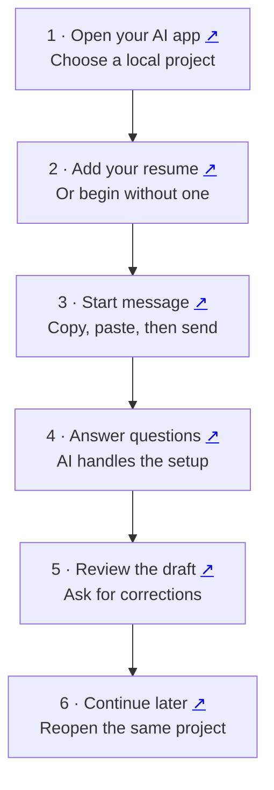
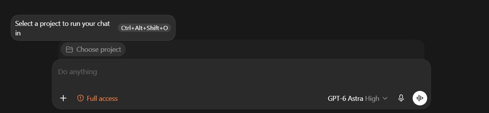
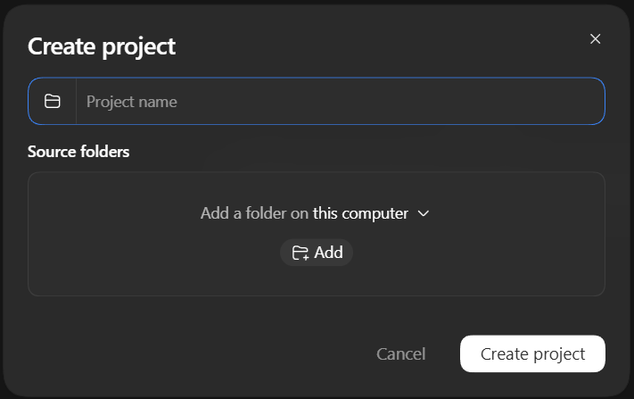
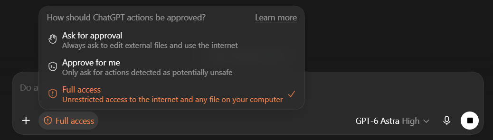
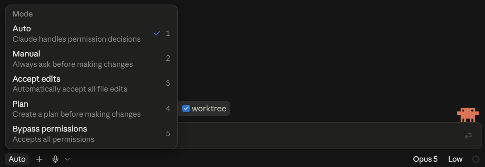

# Job Search

Your job search, guided through a conversation in **Codex or Claude Code**. You supply your experience and decisions. The AI organizes the files, asks questions, and prepares applications for your review.

**[First time: start here](#first-time-step-by-step)** · **[Already installed](#already-installed)** · **[Coming back later](#coming-back-later)** · **[Need help?](#if-something-stops-you)**

**Share the short guide:** [PDF](docs/job-search-guide.pdf) · [PowerPoint slides](docs/job-search-guide.pptx). Both include app download links, project screenshots and the exact first message. See the [final installation audit](docs/FINAL-AUDIT.md) for tested behavior and limits.

## The flow at a glance

Click the small ↗ beside a step to open its instructions.



## First time: step by step

### 1. Open Codex or Claude Code

**Need the desktop app? Choose your computer below.** These official pages let you select and download the app before returning here.

| App | Mac | Windows |
| --- | --- | --- |
| Codex | [Mac download page (Apple Silicon)](https://learn.chatgpt.com/docs/app) | [Windows download page](https://learn.chatgpt.com/docs/windows/windows-app#download-the-chatgpt-desktop-app) |
| Claude Code | [Claude downloads: choose macOS](https://claude.com/download) | [Claude downloads: choose Windows or Windows ARM64](https://claude.com/download) |

Open a link in a new tab with **Ctrl+click** on Windows or **Command+click** on Mac, or right-click and choose **Open link in new tab**. This README uses explicit computer choices rather than trying to detect your operating system.

For Codex, the current download is the **ChatGPT desktop app**; open it and select **Codex**. For Claude Code, install **Claude**, then open its **Code** tab. The apps have their own account requirements; check the [Claude Code setup page](https://code.claude.com/docs/en/desktop-quickstart) if Code prompts you to upgrade. Already installed? Continue below. Sources: [OpenAI desktop setup](https://learn.chatgpt.com/docs/app), [Claude downloads](https://claude.com/download).

Sign in to a version that can work with files on your computer. Start a conversation in a **dedicated local project/folder**, such as **My Job Search**. Here, “project” simply means the folder the AI is working in.

Use a local session, rather than an ordinary browser chat. You do not need to download this repository or create the skill's internal folders yourself.

**Follow the instructions for your app, then check permissions below.**

#### Codex: choose or create your project

1. Above the message box, click **Choose project**.

   

2. Select your existing **My Job Search** project, or open **Create project** to make one.
3. In **Create project**, enter a name such as **My Job Search**. Under **Source folders**, choose **Add a folder on this computer**, then click **Add**.

   

4. In the folder picker, select a folder dedicated to this search. To make one, use **New folder** if available. Otherwise, create **My Job Search** in Documents using File Explorer (Windows) or Finder (Mac), then select it in the picker. Creating a project name alone does not select a disk folder.
5. Confirm the folder selection, then click **Create project**. Make sure that project is selected above the message box before sending anything.

These are real Codex screenshots supplied for this guide. Labels can vary by version. The **Full access** setting shown is the choice used in this walkthrough. See the [Codex project guide](https://learn.chatgpt.com/docs/projects).

#### Claude Code: choose your folder

1. Open Claude desktop's **Code** tab and select **Local**.
2. Click **Select folder**. Choose a dedicated **My Job Search** folder. To start with a new folder, create it in your computer's file manager first, then select it.
3. Confirm the selected folder and use the message box in that local session. The screenshots above show Codex; Claude's controls look different. See the [official Claude setup walkthrough](https://code.claude.com/docs/en/desktop-quickstart#start-your-first-session).

Using a terminal or editor instead? Open the same dedicated folder as the working directory before starting Codex or Claude Code.

#### Allow the AI to read and save files

**For this walkthrough, select Full access in Codex or Auto in Claude Code**, matching the screenshots below. The skill needs to read your resume, create folders, save records and run its installation and document tools. These settings are controlled by your app, separately from model selection.

| App | Select this setting | What it allows |
| --- | --- | --- |
| Codex | Click the permission label at the lower left of the message box, then select **Full access**. Check that **Full access** appears beside the shield icon. | Unrestricted access to the internet and files on your computer, including files outside the selected project. |
| Claude Code | Click the mode label at the lower left of the message box, then select **Auto**. Check that **Auto** appears below the message box. | Claude handles permission decisions using background safety checks. Some actions can still require your input. |

**Codex: select Full access**



**Claude Code: select Auto**



These screenshots show the guide author's current desktop apps. **Full access grants access beyond your project folder; Claude's Auto keeps automatic safety checks.** These are the settings chosen for this walkthrough. More restrictive modes can also run the skill with your approvals. If a setting is unavailable, check your app version or organization policy. Sources: [Codex permissions](https://learn.chatgpt.com/docs/agent-approvals-security), [Claude permission modes](https://code.claude.com/docs/en/desktop#choose-a-permission-mode).

If the AI needs a separate private records folder outside the selected project, approve that **specific folder** when asked, or give it another writable location. Keep candidate records outside the downloaded public repository and installed skill. Protected skill folders can still require installation approval even when ordinary project files are writable.

**Before continuing:** the correct project is selected, file editing is allowed, and you are ready to approve the installation if asked. The AI handles the remaining folders and files. On later visits, check the selected project and permission mode again if saving stops working.

### 2. Add your resume before sending

Use **one** method:

- **Attach it:** if your app accepts the document, add your PDF or Word resume using its attachment control. Check that the attachment appears before sending.
- **Supply its location:** copy the full location of the resume on your computer. Paste it beneath the message in step 3, after `My resume is at:`. Use the actual location of your file.
- **No resume yet:** add `I do not have a resume yet. Help me build one.` The AI can start by asking about your work or study.

The AI must confirm it can read the file. An attachment icon alone does not prove that it received readable resume text.

<a name="3-paste-this-message-then-press-send"></a>

### 3. Copy the start message, then press Send

Copy the complete message below into the **same message box** where you added your resume or its location:

```text
Install https://github.com/toughdave/job-search for this project.
Then use job-search to start my search.
```

**Send this once.** It asks the AI to install and begin; you do not also need a terminal command or “Continue my job search” now. Include your resume location or no-resume line before sending if you chose that option.

One-question pacing, waiting for your answers, saving progress and managing files are built into the skill. You do not need to repeat those instructions. A native goal or recurring schedule is optional and can be requested later.

### 4. Let the AI set up, then answer its questions

The AI should check the installation, read your resume, create a separate private place for your records, and ask one useful question at a time. It should tell you where it saved your search. If it needs an installation approval, a writable location, or a restart, follow that specific instruction before continuing.

For example, after reading your resume it might ask:

> **AI:** What kind of work would you most like to do next?
>
> **You:** Office administration or customer support.

Give your own answer. The AI saves it and asks the next question when needed. You do not fill out a tracker or arrange application folders.

It also asks for relevant real examples beyond your resume: what happened, what you personally did, which tools you used, and the result or lesson. Its project-specific checklist is checked against saved answers before it asks again. If you pause halfway through, it should resume the missing detail. It will offer an optional LinkedIn review; you can say yes, no, or later.

### 5. Review the first useful result

When enough is known and the tools are available, the AI works toward a suitable application draft. Open its documents, check the facts, and give corrections in the conversation. For example: `That role was volunteering. Please correct it.`

If it cannot search the web, it may ask for a job posting. If a required fact or tool is missing, it should explain the next action instead of claiming the application is ready. Review the employer, role and document versions before authorizing a final submission.

**That is the first-time process. The sections below are for later visits or optional help.**

## Already installed

Skip installation. Open the **same local project**, add your resume or its location if you have not already supplied it, and send:

```text
Use job-search.
```

If the AI cannot find the skill, see [Need help?](#if-something-stops-you). If your search is already set up, use the returning message below instead.

## Coming back later

1. Reopen the **same project and conversation** you used before.
2. Send this message:

   ```text
   Continue my job search.
   ```

3. The AI should read your saved progress and continue the next action. Answer any new question or review the next result.

You do not normally reinstall or attach the same resume again. Supply a new resume when it changes. If a new conversation cannot find your records, provide the private workspace location from step 4 and say `Resume my existing search at this location; do not start over.` Records on one computer do not automatically appear on another.

For an independent search in a different occupation, use a new project and say `Use job-search for my new occupation.` It creates separate records and asks the relevant questions there. It must not read or reuse another project's private evidence or consent unless you explicitly ask it to copy specified material.

## If something stops you

| What happened | What to do |
| --- | --- |
| “I cannot read your resume.” | Attach it again if supported, or supply its actual file location. If still unreadable, paste the resume text when asked. |
| “The skill is not available.” | Send `Check whether job-search is installed in this project and help me load it.` Follow a restart instruction only if needed. |
| The app asks for permission or a missing tool. | Review the request and allow what you want it to do. If you cannot proceed, tell the AI what the message says. |
| It asks questions you already answered. | Say `Read my saved job-search records first.` Supply the saved location if this is a different conversation. |

## What happens automatically?

Once installed and available, the skill instructs the AI to manage setup, saved answers, evidence, job screening, document versions and application records. **Sharing or opening the GitHub link alone does not install or start it**—send the first-time message in the AI app.

The AI still needs your real answers and your app's file, web and document capabilities. It may need approval for access or installation. Accounts, recurring searches and final submissions are not activated by installation. Later, you can ask for a regular search schedule; the AI must check what your app supports and confirm the actual setup.

<details>
<summary><strong>Optional: install using a terminal</strong></summary>

Use this alternative only if you prefer a terminal. Run it in your chosen job-search project with Node.js 22.20 or newer:

```sh
npx skills@1.5.26 add toughdave/job-search --skill job-search --agent codex claude-code --copy -y
```

This installs project copies for both apps. Then follow [Already installed](#already-installed). You can also explicitly invoke the skill in the app's message box:

| App | Message |
| --- | --- |
| Codex CLI/IDE | `$job-search Use my resume to start my search.` |
| Claude Code | `/job-search Use my resume to start my search.` |

The natural-language messages above avoid needing to remember these shortcuts. Installing in one project does not make the skill available in every project.

</details>

<details>
<summary><strong>How this works, documentation and validation</strong></summary>

The [installing instructions](INSTALL.md) are for the AI. The reusable skill is in [skills/job-search](skills/job-search/SKILL.md). It keeps private records outside the installed skill and public repository. Installation does not alter another candidate's pipeline.

The state helper uses Python 3.10+; document tools may need extra packages or a renderer. The AI checks these and handles supported local setup. Other AI tools need separate capability checks. No hiring outcome is guaranteed.

[Validation and limitations](docs/VALIDATION.md) · [Design](docs/DESIGN.md) · [Tests](tests) · [Attribution](NOTICE.md)

Official instructions checked for this guide: [Codex skills](https://learn.chatgpt.com/docs/build-skills), [local projects](https://learn.chatgpt.com/docs/projects), [Claude Code desktop setup](https://code.claude.com/docs/en/desktop-quickstart), [Claude Code skills](https://code.claude.com/docs/en/skills), and [GitHub section links](https://docs.github.com/en/get-started/writing-on-github/getting-started-with-writing-and-formatting-on-github/basic-writing-and-formatting-syntax#section-links). App labels and attachment methods can vary by version.

</details>
