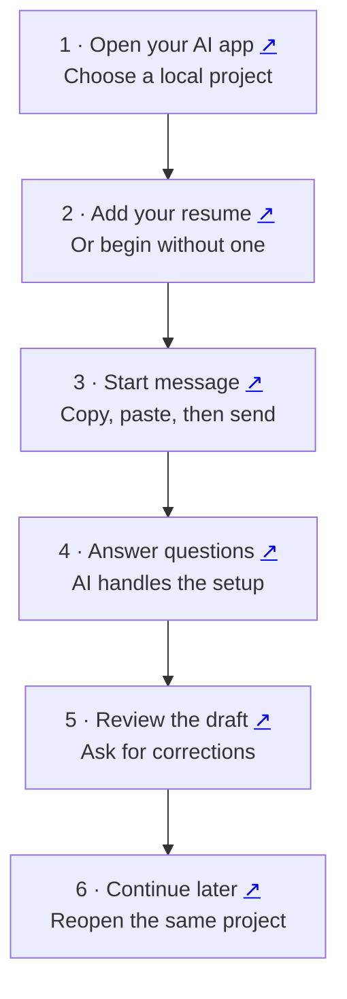

# Job Search

A guided job search in **Codex or Claude Code**. You answer questions and review applications; the AI organizes your records and prepares the documents.

[Start here](#first-time-step-by-step) · [Use it again](#coming-back-later) · [Daily search](#your-weekday-morning-search) · [Help](#if-something-stops-you)

**Share:** [PDF guide](docs/job-search-guide.pdf) · [Slides](docs/job-search-guide.pptx) · [Detailed setup with screenshots](docs/setup.md)

## The flow at a glance

Click the small ↗ beside a step to open its instructions.



## First time: step by step

### 1. Open Codex or Claude Code

**a. Install and sign in.** Choose your computer:

| App | Mac | Windows |
| --- | --- | --- |
| Codex | [Download page](https://learn.chatgpt.com/docs/app) | [Download page](https://learn.chatgpt.com/docs/windows/windows-app#download-the-chatgpt-desktop-app) |
| Claude Code | [Claude downloads](https://claude.com/download) | [Claude downloads](https://claude.com/download) |

For Codex, install the ChatGPT desktop app and select Codex. For Claude, open **Code → Local**. Ctrl+click (Windows) or Command+click (Mac) opens a link in a new tab.

**b. Choose a folder.** Create **My Job Search** in Documents. In Codex, click **Choose project** and add that folder; in Claude Code, click **Select folder**. An existing dedicated folder works too. [See screenshots](docs/setup.md#a-choose-your-project).

<a name="allow-the-ai-to-read-and-save-files"></a>

**c. Set permissions.** Choose **Full access** in Codex or **Auto** in Claude Code. Full access includes files outside this folder; Auto can still ask for approval. [See both permission menus](docs/setup.md#c-codex-full-access).

### 2. Add your resume before sending

Attach your PDF/Word resume, or paste its full file location into the message box. No resume? Add: **“I do not have a resume yet. Help me build one.”**

You can also paste your **LinkedIn profile link** now. The AI checks the resume is readable and asks about any missing link before formatting your resume. Both are optional.

<a name="3-paste-this-message-then-press-send"></a>

### 3. Copy the start message, then press Send

Paste both lines into the **same message box** as your resume or its location:

```text
Install https://github.com/toughdave/job-search for this project.
Then use job-search to start my search.
```

Send once. Follow any specific installation approval or restart instruction.

### 4. Let the AI set up, then answer its questions

It asks **one question at a time** about your goals, each employer, real examples, education and other missing details. It saves progress in a private location and tells you where.

It also offers LinkedIn review and a weekday search routine. With your permission, additional LinkedIn details enrich your records; the fuller profile review comes after enough information is gathered. Public profile edits require your approval.

### 5. Review the first useful result

Open the draft, check its facts and give corrections in the conversation. The AI can start useful drafts while the interview continues. Review the employer and final documents before authorizing submission.

<a name="coming-back-later"></a>

## 6. Coming back later

Reopen the **same project**, summon the skill below, and send **“Continue my job search.”** No reinstall or repeat resume attachment is normally needed.

<a name="already-installed"></a>

## Summon the skill

Use your AI's message box after installation:

| App | Shortcut |
| --- | --- |
| Codex / ChatGPT desktop | Type `@` and choose **job-search**; use `$` if your composer has that skill picker. |
| Codex CLI / IDE | `$job-search` |
| Claude Code | `/job-search` |

Add your request and send. If it cannot find the skill, say **“Check whether job-search is installed in this project and help me load it.”**

## Your weekday morning search

During setup, the AI proposes job titles and search sites, then offers **weekdays at 9 a.m.** It confirms your timezone and preferences; you can change the time or keep searches manual.

Keep the computer awake and desktop app running for local searches. Review the task in Codex **Scheduled** or Claude Code **Code → Routines**. Say **“Pause my scheduled search”** or **“Move it to 8 a.m.”** to change it. [More about daily searches and CLI limits](docs/setup.md#your-weekday-morning-search).

## If something stops you

Tell the AI what happened. For missing records, provide the private location it gave you and say **“Resume my existing search here; do not start over.”** [More help](docs/setup.md#if-something-stops-you).

<details>
<summary>Update or install from a terminal</summary>

To update, send:

```text
Update job-search from https://github.com/toughdave/job-search.
Preserve my private records and local customizations, then continue my search.
```

Or install from your project terminal with Node.js 22.20+:

```sh
npx skills@1.5.26 add toughdave/job-search --skill job-search --agent codex claude-code --copy -y
```

Then summon the skill above. Opening the GitHub link alone does not install it.

</details>

[Full walkthrough](docs/setup.md) · [Skill instructions](skills/job-search/SKILL.md) · [Audit and limitations](docs/FINAL-AUDIT.md) · [Design](docs/DESIGN.md)
