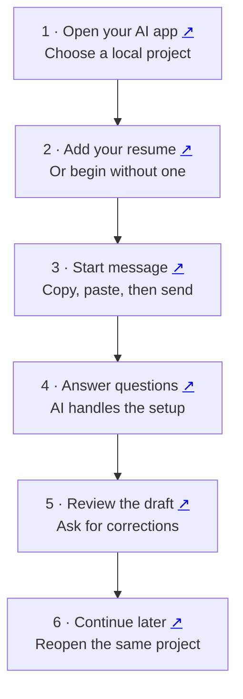

# Job Search

A guided job search in **Codex or Claude Code**. You answer questions and review applications; the AI organizes your records and prepares the documents.

[Start here](#first-time-step-by-step) · [Use it again](#coming-back-later) · [Daily search](#your-weekday-morning-search) · [Help](#if-something-stops-you)

**Share:** [PDF guide](docs/job-search-guide.pdf) · [Slides](docs/job-search-guide.pptx) · [Full walkthrough](docs/setup.md)

## The flow at a glance

Click the small ↗ beside a step to open its instructions.



## First time: step by step

### 1. Open Codex or Claude Code

#### a. Install and sign in

Choose your computer, download the app and sign in:

| App | Mac | Windows |
| --- | --- | --- |
| Codex | [Download page](https://learn.chatgpt.com/docs/app) | [Download page](https://learn.chatgpt.com/docs/windows/windows-app#download-the-chatgpt-desktop-app) |
| Claude Code | [Claude downloads](https://claude.com/download) | [Claude downloads](https://claude.com/download) |

For Codex, install the ChatGPT desktop app and select **Codex**. For Claude, open its **Code** tab and choose **Local**.

Ctrl+click on Windows or Command+click on Mac opens a download link in a new tab.

#### b. Choose your project

A project is the folder the AI works in. Use a dedicated folder such as **My Job Search** so your search records have a clear home.

**Codex:** click **Choose project** above the message box. Select an existing job-search project, or open **Create project**.


**Claude Code:** open **Code → Local**, then click **Select folder**. Choose your existing job-search folder, or create one as described next.

#### c. Select or create the folder

If you need a new folder, create **My Job Search** in Documents using File Explorer on Windows or Finder on Mac. You can also use **New folder** in the folder picker if available.

In Codex's **Create project** window:

- Enter **My Job Search** as the project name.
- Under **Source folders**, choose **Add a folder on this computer**, then click **Add**.
- Select your folder and confirm, then click **Create project**.


In Claude Code, select the folder through **Select folder** and confirm. The picture above shows Codex; Claude's folder picker looks different.

Check that your chosen project is selected before sending the first message. The AI creates the remaining folders and records for you.

<a name="allow-the-ai-to-read-and-save-files"></a>

#### d. Codex: choose Full access

Click the permission label below the message box and select **Full access**.


Full access allows internet access and file changes, including files outside the selected project. This is the Codex setting used in this walkthrough.

#### e. Claude Code: choose Auto

Click the mode label below the message box and select **Auto**.


Claude handles permission decisions with automatic safety checks. Some actions can still require your approval.

These screenshots show the author's desktop apps; labels can vary by version. If the AI requests access to a particular records folder or approval to install the skill, review that specific request. [More about permissions](docs/setup.md#allow-the-ai-to-read-and-save-files).

### 2. Add your resume before sending

Choose **one** way to begin:

- **Attach a resume:** add your PDF or Word file to the message box before sending.
- **Use its file location:** paste the full location beneath the start message, after `My resume is at:`.
- **Start without one:** add `I do not have a resume yet. Help me build one.`

The AI checks that it can read your resume. If it cannot, it asks for the missing file or readable text.

You can also paste your **LinkedIn profile link** now. If you want it on your resume, the AI saves the correct link before formatting. A resume and a LinkedIn profile are both optional.

<a name="3-paste-this-message-then-press-send"></a>

### 3. Copy the start message, then press Send

Paste both lines into the **same message box** as your resume or its location:

```text
Install https://github.com/toughdave/job-search for this project.
Then use job-search to start my search.
```

**Press Send once.** This message asks the AI to install the skill and begin your setup. Follow any specific installation approval or restart instruction.

You do not need to add instructions about asking one question at a time or managing files. Those are built into the skill.

### 4. Let the AI set up, then answer its questions

The AI saves your records in a private location and tells you where. It asks **one question at a time**, reusing information you have already supplied.

The conversation covers the details needed for your search:

- Your target work, location and working preferences.
- Each employer, role and period, with real examples of what you did.
- Education, certifications, skills, contact details and relocation preferences.
- Common application answers, either during setup or when a form needs them.

For example, it might ask:

> At Cedar Clinic, tell me about one scheduling problem you handled as an office assistant.

Your answer stays linked to that employer and work period. If the session ends, the AI reads the saved progress before continuing.

**LinkedIn:** with your permission, it compares your profile with your records, brings in additional useful details and asks about conflicts. It offers a fuller profile review after enough career information is gathered. Public edits require your approval.

**Daily search:** it also offers a weekday morning routine. You can accept it, change the time or keep searches manual.

### 5. Review the first useful result

The AI can prepare useful drafts while the interview continues. Open the documents and check your experience, dates, qualifications and contact details.

Give corrections directly in the conversation, for example:

> That role was volunteering. Please correct it.

Review the employer, role and final documents before authorizing submission. If information or access is missing, the AI should explain the next action.

<a name="coming-back-later"></a>

## 6. Coming back later

**a. Reopen** the same project you used before.

**b. Summon** the skill using your app's shortcut below, then send:

```text
Continue my job search.
```

**c. Continue** from your saved progress. Supply a new resume if it has changed; otherwise you do not normally need to reinstall or attach it again.

<a name="already-installed"></a>

## Summon the skill

Use your AI's message box after installation:

| App | Shortcut |
| --- | --- |
| Codex / ChatGPT desktop | Type `@` and choose **job-search**; use `$` if your composer has that skill picker. |
| Codex CLI / IDE | `$job-search` |
| Claude Code | `/job-search` |

Add **Start my search** or **Continue my job search**, then send.

If the skill is missing, say: **“Check whether job-search is installed in this project and help me load it.”**

## Your weekday morning search

During setup, the AI proposes job titles and search sites, then offers **weekdays at 9 a.m.** It confirms your timezone and preferences; you can change the time or keep searches manual.

The AI saves the daily instructions and checks unfinished applications alongside new listings. Suitable matches become drafts for your review.

Keep your **computer awake and desktop app running** for local searches. Find the scheduled task here:

- **Codex:** Scheduled.
- **Claude Code:** Code → Routines.

To change it, say **“Pause my scheduled search”** or **“Move my daily search to 8 a.m.”**

[More about daily searches and CLI limits](docs/setup.md#your-weekday-morning-search).

## If something stops you

Tell the AI what happened. For missing records, provide the private location it gave you and say **“Resume my existing search here; do not start over.”** [More help](docs/setup.md#if-something-stops-you).

<details>
<summary>Update or install from a terminal</summary>

To update, send:

```text
Update job-search from https://github.com/toughdave/job-search.
Preserve my private records and local customizations, then continue my search.
```

Or install from your project terminal with Node.js 22.20+:

```sh
npx skills@1.5.26 add toughdave/job-search --skill job-search --agent codex claude-code --copy -y
```

Then summon the skill above. Opening the GitHub link alone does not install it.

</details>

[Full walkthrough](docs/setup.md) · [Skill instructions](skills/job-search/SKILL.md) · [Audit and limitations](docs/FINAL-AUDIT.md) · [Design](docs/DESIGN.md)
